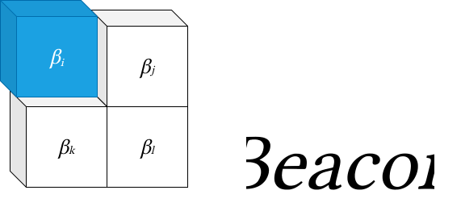

# Beacon



Beacon (***Be***t***a*** ***Con***structor) is a Python toolkit for end-to-end
index, ETF, and Delta-1 derivatives development — from defining an index
methodology, through calculating its historical levels, to backtesting a
tracking portfolio and analysing the result.

> Status: under active development.

## Architecture

Beacon is organised around a three-layer pipeline. Each layer has a single
responsibility and depends only on the layer(s) below it, which keeps the
methodology, the calculation, and the simulation cleanly separated.

```
        ┌──────────────────────────────────────────────┐
        │  Methodology                                   │
        │  eligibility rules + weighting schemes         │
        │  (what belongs in the index and at what weight)│
        └───────────────────────┬────────────────────────┘
                                │  defines
                                ▼
        ┌──────────────────────────────────────────────┐
        │  Calculator                                    │
        │  IndexCalculator.run() -> IndexResult          │
        │  (levels, divisor, constituent/weight history) │
        └───────────────────────┬────────────────────────┘
                                │  target weights
                                ▼
        ┌──────────────────────────────────────────────┐
        │  Backtest                                      │
        │  BacktestEngine.run() -> BacktestResult        │
        │  (NAV, trades, tracking error vs. the index)   │
        └──────────────────────────────────────────────┘
```

Funds (`IndexFund`, `ETF`) compose the Calculator and Backtest layers, and the
Derivatives layer prices instruments off the levels an `IndexResult` produces.

## Modules

- **`index`** — Index construction and calculation. `IndexDefinition` captures
  the static rules (universe, currency, base date, rebalance frequency);
  `methodology` provides the eligibility rules and weighting schemes (e.g.
  `EqualWeighted`, `MarketCapWeighted`); `IndexCalculator` runs the day-by-day
  calculation and returns an `IndexResult` with index levels, divisor history,
  and constituent/weight snapshots.
- **`backtest`** — Portfolio simulation. `BacktestEngine` consumes a target
  weight schedule (an `IndexResult` or a custom weight dict), simulates trading
  with configurable transaction costs, and returns a `BacktestResult` exposing
  NAV, cash and weight history, transactions, and tracking metrics.
- **`portfolio`** — The `Portfolio` accounting primitive: holdings, cash,
  transactions, valuation and weights, plus Excel reporting helpers. It has no
  dependency on assets or data sources — callers pass identifiers and prices.
- **`fund`** — Investable vehicles. `IndexFund` composes an `IndexCalculator`
  and a `BacktestEngine` to track an index (with management-fee accrual); `ETF`
  extends it with a ticker, creation-unit size, market-price simulation, and
  tracking-performance analysis.
- **`derivatives`** — Delta-1 instruments referencing indices/ETFs/equities:
  `IndexFuture`, `ETFFuture`, and `TotalReturnSwap`, built on a `DerivativeBase`
  ABC, plus pure `pricing` functions (cost-of-carry, discrete-dividend forward,
  implied repo, roll return, TRS breakeven spread).
- **`analysis`** — Performance and risk analytics, including ETF tracking
  metrics (`analysis.etf`), attribution, and risk measures.
- **`data`** — Market and reference data access. `MarketData`/`ReferenceData`
  wrap tabular sources and `DataFetcher` provides a unified query interface used
  throughout the calculation and backtest layers.
- **`environment`** — The `Environment` configuration object that centralises
  run-level settings.

## Installation

Beacon targets Python 3.9+. Clone the repository and install it in editable
mode (a virtual environment is recommended):

```bash
git clone https://github.com/karanbh01/py-beacon.git
cd py-beacon
python -m venv .venv && source .venv/bin/activate   # Windows: .venv\Scripts\activate
pip install -e .
```

Core dependencies (pandas, numpy, scipy, matplotlib, seaborn,
scikit-optimize) are installed automatically. To run the test suite:

```bash
pip install pytest
pytest
```

## Quickstart

Define an index, calculate it, backtest a portfolio that tracks it, and view
the results. This snippet is fully self-contained (synthetic data, no external
dependencies) and copy-paste runnable:

```python
import logging
import pandas as pd
from beacon.index.constructor import IndexDefinition
from beacon.index.methodology import EqualWeighted
from beacon.index.calculation import IndexCalculator
from beacon.backtest.engine import BacktestEngine

logging.getLogger("beacon").setLevel(logging.ERROR)  # keep the demo output clean

# --- 1. Synthetic market data: two assets over ~3 months of business days ---
ASSETS = ["AAA", "BBB"]
DAYS = pd.bdate_range("2024-01-02", "2024-03-29")

def price(asset, day):
    frac = DAYS.get_loc(day) / (len(DAYS) - 1)
    return (100 * 1.10 ** frac) if asset == "AAA" else (50 * 1.20 ** frac)

class QuickData:
    """Tiny in-memory provider satisfying the calculator + engine data APIs."""
    def fetch_reference_data(self, identifier, date=None):
        return pd.DataFrame(
            {"NAME": [identifier], "CURRENCY": ["USD"], "EXCHANGE": ["NYSE"]},
            index=pd.Index([identifier], name="IDENTIFIER"))
    def fetch_prices(self, ticker, start, end):
        p = price(ticker, pd.Timestamp(start))
        return pd.DataFrame({"Adj Close": [p], "Close": [p]},
                            index=pd.Index([pd.Timestamp(start)], name="Date"))
    def fetch_shares_outstanding(self, ticker, date):
        return 1_000
    def fetch_market_data(self, identifier, start=None, end=None, columns=None):
        p = price(identifier, pd.Timestamp(start))
        return pd.DataFrame({"CLOSE": [p]}, index=pd.Index([pd.Timestamp(start)], name="DATE"))

data = QuickData()

# --- 2. Define the index: equal-weight, rebalanced monthly ---
definition = IndexDefinition(
    index_id="DEMO", index_name="Demo Equal-Weight Index",
    base_date="2024-01-02", base_value=1000.0, currency="USD",
    eligibility_rules=[], weighting_scheme=EqualWeighted(),
    rebalancing_frequency="MONTHLY", universe_identifiers=ASSETS,
)

# --- 3. Calculate the index ---
index_result = IndexCalculator(definition, data).run(end_date="2024-03-29")
print("Final index level:", round(index_result.index_levels.iloc[-1], 2))

# --- 4. Backtest a portfolio that tracks the index ---
backtest = BacktestEngine(
    start_date="2024-01-02", end_date="2024-03-29",
    initial_capital=1_000_000.0, data_provider=data,
    target_index_result=index_result,
).run()

# --- 5. View results ---
summary = backtest.summary()
print("Total return:      ", round(summary["total_return"], 4))
print("Annualised return: ", round(summary["annualised_return"], 4))
print("Tracking error:    ", round(summary["tracking_error"], 6))
```

For a derivatives walkthrough — pricing an `IndexFuture` off an `IndexResult` —
see [`examples/futures_pricing_example.py`](./examples/futures_pricing_example.py).
