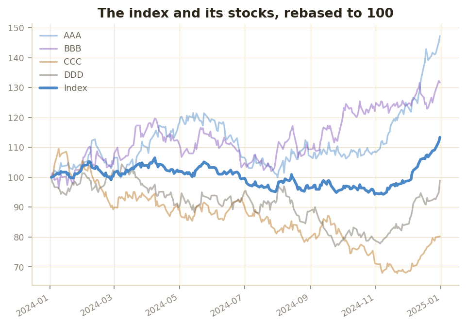
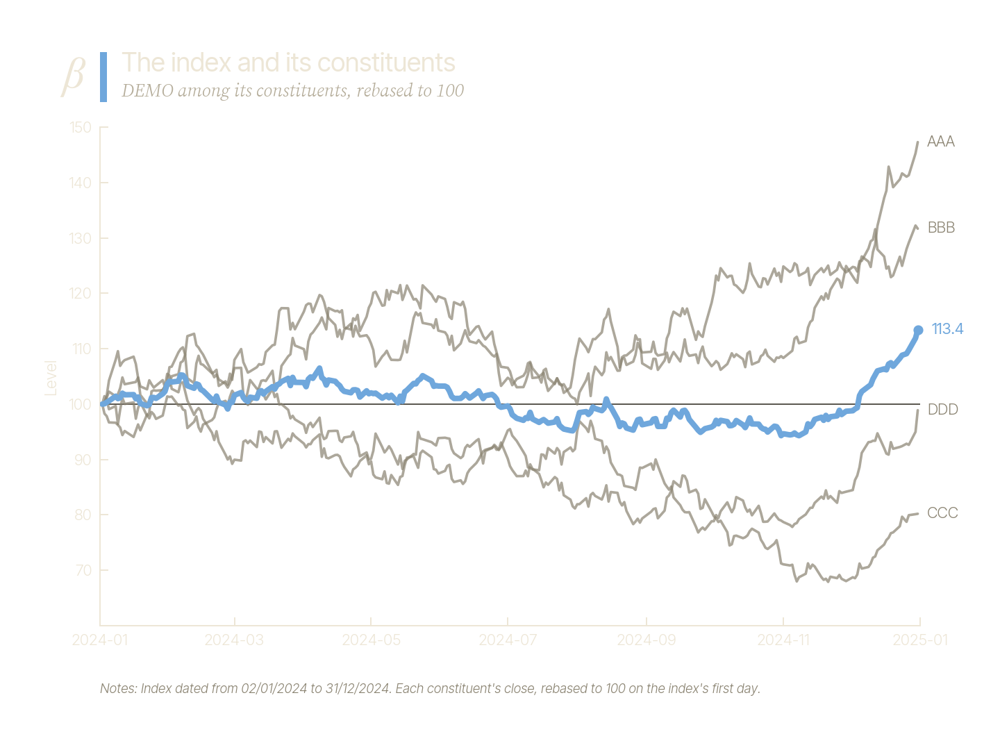
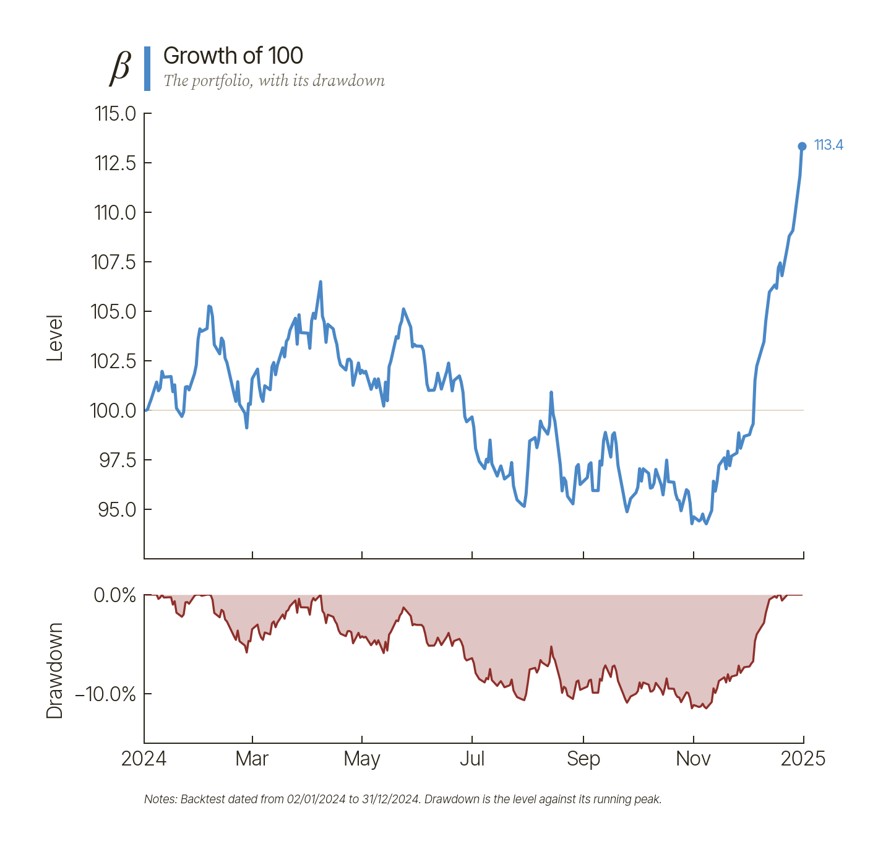
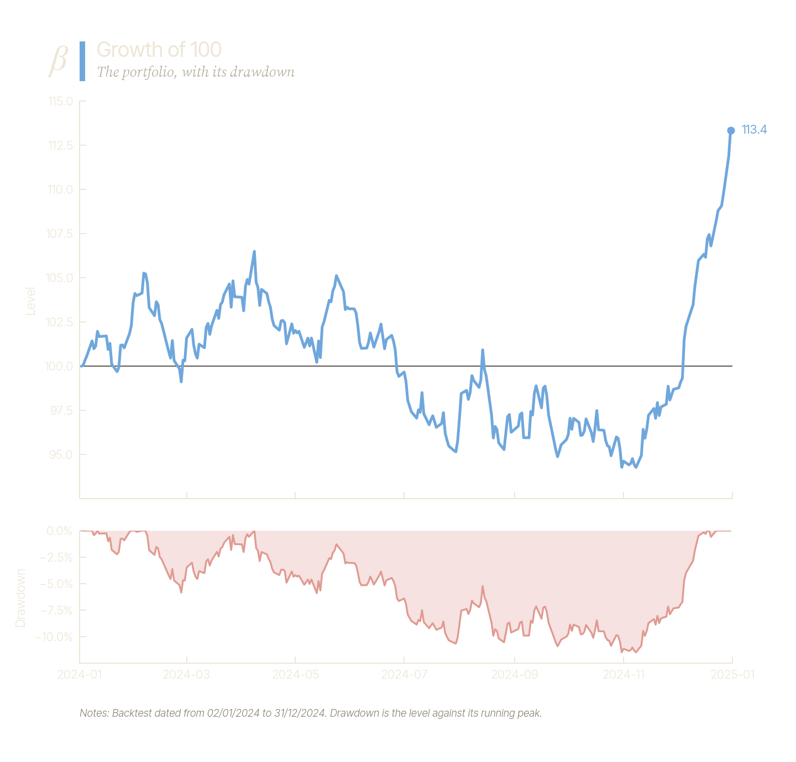

# py-beacon

py-beacon is a Python library for building indices, ETFs and Delta-1
derivatives. You define an index methodology, calculate the index's history
on a real exchange calendar, backtest a portfolio that tracks it, and analyse
the result. The same library runs the local engine behind the Beacon desktop
app.

## Install

py-beacon needs Python 3.11 or later.

```bash
pip install py-beacon-kit
```

In code, import it as `beacon`. The core installs pandas, numpy, pydantic and
exchange_calendars, and covers data, indices, backtests, portfolios, funds,
derivatives, risk and analysis.

Everything else is an extra, so a plain install stays small:

| Extra | Adds | For |
| --- | --- | --- |
| `data` | yfinance | Downloading prices and reference data from Yahoo Finance |
| `excel` | openpyxl | Excel reports, and importing data from Excel workbooks |
| `postgres` | psycopg | Reading a data store from a Postgres database |
| `optimise` | scipy | Solving optimised indices and portfolios |
| `plot` | matplotlib | Charts drawn from result objects |
| `plot-interactive` | plotly | Reserved for interactive charts; nothing uses it yet |
| `pdf` | reportlab | Rendering PDF reports |
| `server` | fastapi, uvicorn, orjson, websockets, platformdirs, plus `optimise`, `pdf` and `excel` | The local API server |

Install one with `pip install "py-beacon-kit[plot]"`, or several with
`pip install "py-beacon-kit[plot,optimise]"`. Using a feature without its
extra raises a `MissingDependencyError` that names the extra to install. The
`docs` and `dev` extras are for building this site and working on py-beacon
itself.

## Quickstart

Define an index, calculate it, and backtest a portfolio that tracks it. The
example builds its own small dataset, so it runs as it is. Each block is a
cell, as in a notebook, and the charts need the `plot` extra
(`pip install "py-beacon-kit[plot]"`).

```python
import logging

import numpy as np
import pandas as pd

from beacon.backtest import Backtest
from beacon.data import DataFetcher, MarketData, ReferenceData
from beacon.index import EqualWeighted, IndexDefinition
from beacon.index.schedule import sessions

logging.getLogger("beacon").setLevel(logging.ERROR)  # keep the output short
```

**Data.** Four stocks priced on every New York Stock Exchange session in
2024, from a seeded random walk, and the reference data that lists them.

```python
days = sessions(pd.Timestamp("2024-01-02"), pd.Timestamp("2024-12-31"), "XNYS")
names = ["AAA", "BBB", "CCC", "DDD"]

rng = np.random.default_rng(28)
returns = rng.normal(0.0004, 0.015, size=(len(days), len(names)))
closes = pd.DataFrame(100 * np.exp(returns.cumsum(axis=0)),
                      index=days,
                      columns=names)

prices = [{"IDENTIFIER": name,
           "DATE": day,
           "CLOSE": closes.at[day, name],
           "SHARES_OUTSTANDING": 1_000_000}
          for day in days
          for name in names]
listings = [{"IDENTIFIER": name,
             "NAME": name,
             "CURRENCY": "USD",
             "EXCHANGE": "XNYS",
             "DATE_FROM": "2020-01-01"}
            for name in names]

data = DataFetcher(MarketData.from_dataframe(pd.DataFrame(prices)),
                   ReferenceData.from_dataframe(pd.DataFrame(listings)))
```

**The index.** Equal weight across the four, rebalanced monthly on the NYSE
calendar.

```python
definition = IndexDefinition(index_id="DEMO",
                             index_name="Demo Equal-Weight Index",
                             base_date="2024-01-02",
                             base_value=1000.0,
                             currency="USD",
                             eligibility_rules=[],
                             weighting_scheme=EqualWeighted(),
                             rebalancing_frequency="MONTHLY",
                             calendar="XNYS",
                             universe_identifiers=names)
```

**The backtest.** Calculate the index, then simulate a portfolio trading to
its weights, paying 5 basis points on every trade.

```python
backtest = Backtest(initial_capital=100_000.0,
                    transaction_cost_bps=5.0,
                    data_provider=data)
result = backtest.run(definition,
                      end="2024-12-31")
```

**Results.** The index level and the portfolio's NAV each day, and the
portfolio's summary metrics against the index.

```python
daily = pd.DataFrame({"Index level": result.index.target.levels,
                      "Portfolio NAV": result.portfolio.nav})
daily.tail().round(2)
```

| | Index level | Portfolio NAV |
|---|---:|---:|
| 2024-12-24 | 1088.28 | 108747.08 |
| 2024-12-26 | 1091.06 | 109025.21 |
| 2024-12-27 | 1097.57 | 109675.70 |
| 2024-12-30 | 1119.11 | 111828.46 |
| 2024-12-31 | 1133.80 | 113295.48 |

```python
pd.DataFrame({"Portfolio": result.summary()}).round(4)
```

| | Portfolio |
|---|---:|
| total_return | 0.1330 |
| annualised_return | 0.1330 |
| volatility | 0.1214 |
| sharpe_ratio | 1.0950 |
| max_drawdown | -0.1148 |
| tracking_error | 0.0005 |
| tracking_difference | -0.0008 |

**Charts.** The index among its four stocks, then the portfolio's growth and
drawdown. The charts here have no background of their own:
`transparent-dark-axes` is for a light page and `transparent-light-axes` for
a dark one, and these are shown in whichever matches yours. `use("light")`
and `use("dark")` draw on Beacon's own canvas.

```python
from beacon.plot import use

use("transparent-dark-axes")  # no background, for a light page

result.plot.constituents()
```




```python
result.plot.performance()
```




`result.index.target` holds the index the run aimed at, and
`result.portfolio` holds the simulated portfolio: its NAV, positions, cash and
transactions. The portfolio ends a little behind the index because it pays
for its trades. Even without costs the two rarely agree exactly, because an
index level and a traded portfolio are calculated differently;
[Backtest](concepts/backtest.md) explains why.

## How it fits together

Everything reads its data through one `DataFetcher`, and the work runs in
three layers, each depending only on the ones before it:

```
Methodology   IndexDefinition: universe, rules, weighting, capping, schedule
     |
     v
Calculation   IndexCalculator.run() -> IndexResult
     |        levels, divisor, what each rebalance decided, daily weights
     v
Backtest      Backtest.run() -> BacktestResult
              the portfolio's books, compared with the index it tracked
```

1. **Methodology.** An `IndexDefinition` holds the rules: a universe of
   identifiers, eligibility rules that select from it, a weighting scheme
   (`EqualWeighted`, or `MarketCapWeighted` with optional free-float
   adjustment), an optional cap on any one constituent's weight, and a
   schedule. Every index names a trading calendar (an exchange MIC such as
   `XNYS`); there is no default. The definition also sets the rebalance day
   rule, the return type (price, total return or net total return), and how
   many sessions a new composition waits before taking effect.
2. **Calculation.** `IndexCalculator.run()` walks the sessions of the index's
   calendar and returns an `IndexResult`: the index levels, the divisor
   history, the constituents and weights chosen at each rebalance, and the
   weights held on every day.
3. **Backtest.** `Backtest` is the front door. You give it the assumptions
   (capital, transaction costs in basis points, currency, a benchmark) once,
   then call `run(definition, start, end)` for each index. It calculates the
   index, reusing a cached calculation when it can, and hands the weights to
   `BacktestEngine`, which trades towards them on each rebalance (sells before
   buys). The `BacktestResult` keeps the portfolio's books on
   `result.portfolio`, the calculated index on `result.index`, and the
   benchmark, when one was given, on `result.benchmark`. `summary()` gives
   the headline metrics and `against(other)` compares the run with anything
   that has a level series.

Funds, derivatives, the optimiser, risk models and analytics all build on
these results. [Concepts](concepts/overview.md) walks through each part.

## What's in the library

| Module | What it does | Read more |
| --- | --- | --- |
| `beacon.data` | `MarketData`, `ReferenceData` and the `DataFetcher` every calculation reads through; loading from files, a data store on disk, a Postgres database or Yahoo Finance | [Data](concepts/data.md), [Serving data](serving-data.md) |
| `beacon.synthetic` | Realistic synthetic market data at demo scale, with the reference data, shares, free float and corporate actions to match | [Serving data](serving-data.md) |
| `beacon.testing` | A small, fixed dataset for examples and tests | [Sample dataset](reference/testing.md) |
| `beacon.expressions` | Typed expressions such as `data.market.market_cap > 1e9`, used by rules and universes | [Expressions](concepts/expressions.md) |
| `beacon.universe` | Building a universe by filtering rather than listing | [Universe](concepts/universe.md) |
| `beacon.index` | `IndexDefinition`, eligibility rules, weighting schemes, capping, `IndexCalculator` and `IndexResult`, and optimised indices derived from another index | [Methodology](concepts/methodology.md) |
| `beacon.backtest` | `Backtest`, `BacktestEngine`, modifiers that skip or adjust a rebalance, and `BacktestResult` | [Backtest](concepts/backtest.md) |
| `beacon.portfolio` | The `Portfolio` ledger (holdings, cash, transactions, NAV) and Excel reporting | [Reference](reference/portfolio.md) |
| `beacon.fund` | `Fund`, a fund product with share classes, a strategy and a vehicle | [Funds](concepts/funds.md) |
| `beacon.derivatives` | `IndexFuture`, `ETFFuture` and `TotalReturnSwap`, rate curves, futures term structures and pricing functions | [Derivatives](concepts/derivatives.md) |
| `beacon.optimise` | Constraints and solvers: tracking-error minimisation, minimum variance, efficient frontiers | [Optimiser](concepts/optimiser.md) |
| `beacon.risk` | Covariance estimation with shrinkage, factor models and risk contributions | [Risk model](concepts/risk-model.md) |
| `beacon.analysis` | Attribution, concentration, drift, liquidity, risk metrics and ETF tracking analytics | [Attribution](concepts/attribution.md) |
| `beacon.plot` | Charts through a `.plot` accessor on result objects | [Charts](concepts/charts.md), [Gallery](gallery.md) |
| `beacon.report` | Paginated reports, rendered to PDF | [Reports](concepts/reports.md) |
| `beacon.server` | The local API server Beacon desktop talks to | [Server guide](server.md) |

The [Reference](reference/index.md) documents every public class and
function. The [example notebooks](https://github.com/karanbh01/py-beacon/tree/main/examples)
go further: backtest analysis, index futures, and optimised indices.
